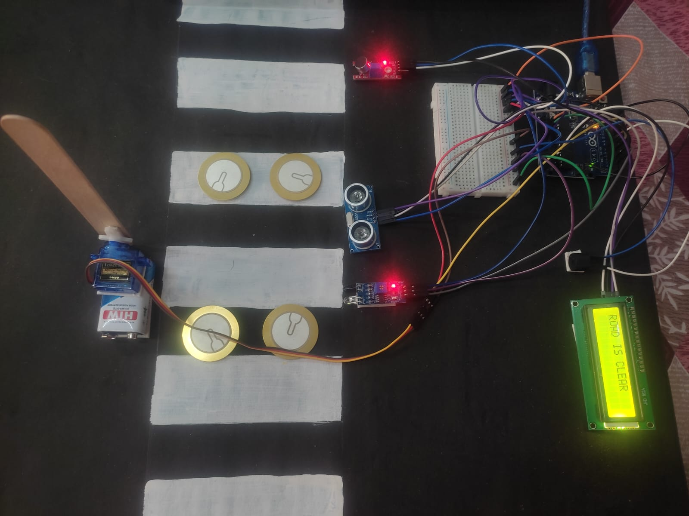
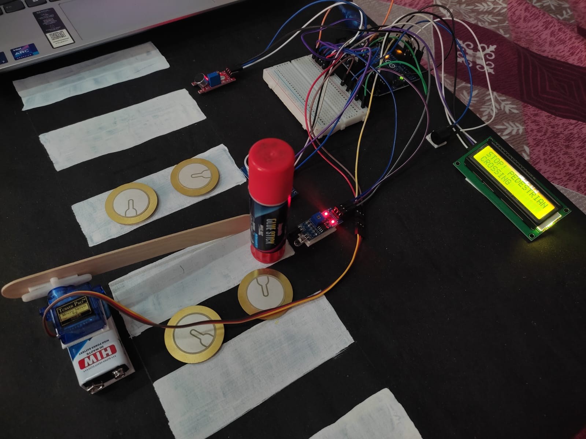
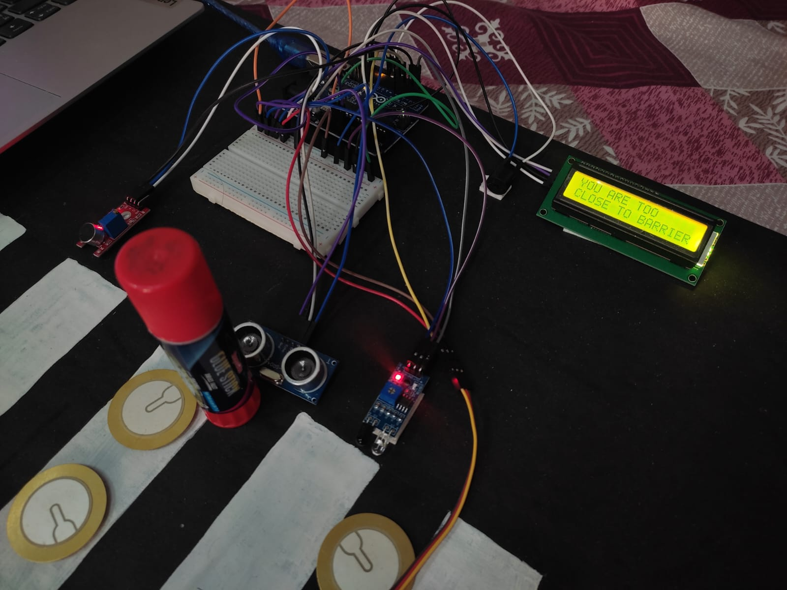
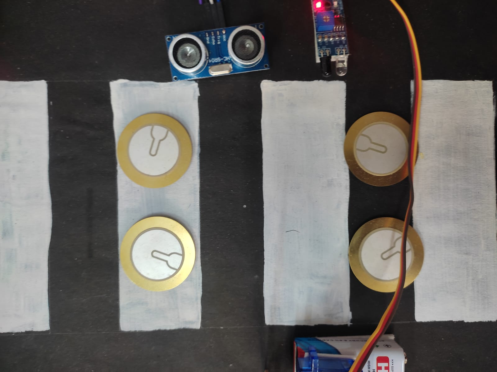

# 🚦 Smart Crossing System with Emergency Priority & Energy Harvesting

An IoT-based intelligent road safety system that uses multiple sensors and automation to improve pedestrian safety, manage traffic flow, and prioritize emergency vehicles — with an added layer of sustainable energy generation using piezoelectric plates.

---

## 📌 Features

- 🚶 Pedestrian detection using IR sensor  
- 🚗 Vehicle proximity detection using ultrasonic sensor  
- 🚑 Emergency vehicle (ambulance and fire vehicles) detection using sound sensor  
- 🚧 Automatic barrier control using servo motor  
- 🔊 Buzzer alert for unsafe vehicle proximity  
- 📟 Real-time status display using LCD  
- ⚡ Piezoelectric energy harvesting for sustainable power  

---

## 🧠 System Architecture

This system integrates multiple sensors, actuators, and energy modules:

- IR sensor → Detects pedestrians  
- Ultrasonic sensor → Measures vehicle distance  
- Sound sensor → Detects ambulance siren  
- Piezoelectric plates → Generate energy from road pressure  
- Arduino → Processes all inputs with priority logic  
- Servo motor → Controls barrier  
- LCD → Displays real-time status  
- Buzzer → Alerts for danger  

---

## ⚙️ Priority Logic

1. 🚑 **Ambulance (Highest Priority)**  
   - Barrier opens immediately  
   - Overrides all conditions (even if pedestrian is present)

2. 🚶 **Pedestrian Detected**  
   - Barrier closes to stop vehicles  

3. 🚗 **Vehicle Too Close**  
   - Buzzer turns ON  

4. ✅ **Normal Condition**  
   - Barrier remains open  

---

## ⚡ Energy Harvesting

- Piezoelectric plates convert mechanical pressure into electrical energy  
- Generated energy is rectified and stored  
- Helps power the system components  
- Makes the system **self-sustainable**

---

## 📸 Project Images
 
  
  
  
  
  

---

## 🎥 Demo Video

▶️ [Watch Demo]([video/demo.mp4](https://drive.google.com/file/d/1PLnyqrELPTGwBE3i7XoFrh_Uo4A9X68C/view))

---

## 📄 Project Report

[View Full Report](documentation/patent_report.pdf)

---

## 🛠️ Tech Stack

- Arduino (Embedded C)  
- Sensors (IR, Ultrasonic, Sound)  
- Servo Motor  
- LCD Display  
- Piezoelectric Modules  

---

## 📁 Folder Structure

 - code/ → Arduino code
 - images/ → Project images
 - video/ → Demo video
 - documentation/ → Patent Report and diagrams
 - hardware/ → Components list

---

## 💡 Conclusion

This project demonstrates a real-world smart transportation solution by combining automation, sensor fusion, and sustainable energy to enhance road safety and efficiency.
